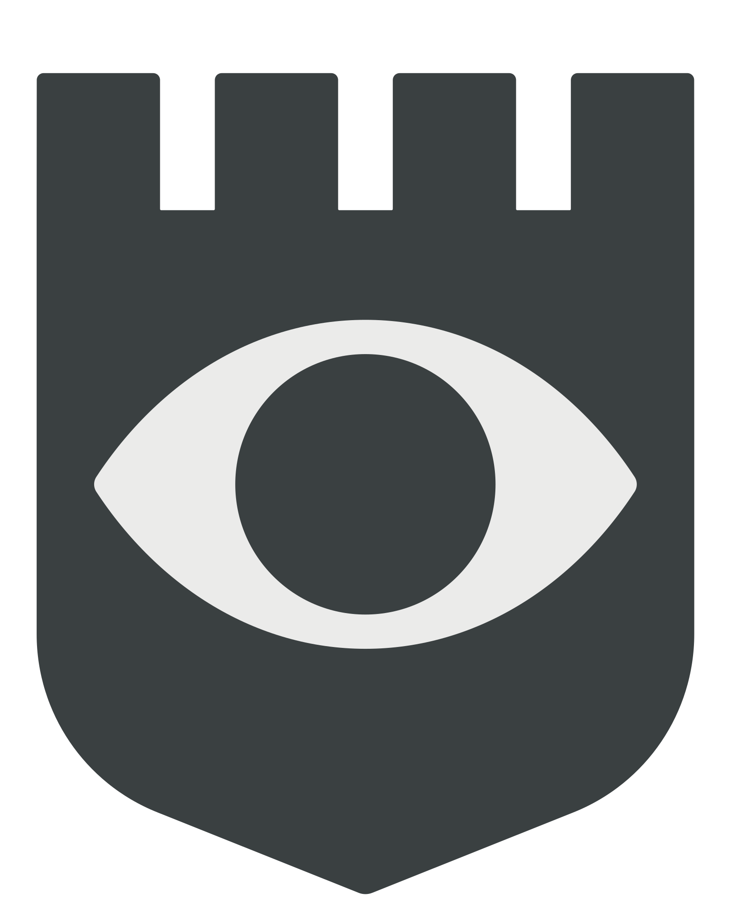

# castles

A satirical tech experiment and demonstration of a mapping interface for the responsive web.

### [Find English castles near you 🏰](https://eye-test.netlify.app/)

## About

### Data

Primarily an excuse to check out [Puppeteer]((https://github.com/puppeteer/puppeteer)), I used this to [scrape](scrape.js) a [list of castles on Wikipedia](https://en.wikipedia.org/wiki/List_of_castles_in_England).

### Map

Secondarily, a way to publicise and build on my Mapbox learnings over the last year or so. Where I’ve used markers in Mapbox for flexibility in styling, GeoJSON layers have proven far more performant. [Component-ising](src/components/CastleMarkers.vue) helps to manage the alternative style options.

Dark mode is supported by the use of two map styles and [a neat trick](https://github.com/jasonhibbs/castles/commit/dc4092b2d808fea51c5a9514901213dda1a39130) to remount the slot content.

### Bottom Sheet

Thirdly, to test yet another approach to the bottom sheet, inspired by Apple Maps. Still not there. The web brings some limitations, and Safari even more. Some of the issues stem from attempts to adjust the scrolling height according to the content in the header of the card.

### Logo

For fun, the logo includes an SVG path transition when hovered. This only works in Chrome afaik.

### Notable Tools

- [puppeteer](https://github.com/puppeteer/puppeteer)
- [vue-mapbox](https://github.com/soal/vue-mapbox)

## Project setup
```
yarn install
```

### Compiles and hot-reloads for development
```
yarn serve
```

### Compiles and minifies for production
```
yarn build
```

### Lints and fixes files
```
yarn lint
```

### Customize configuration
See [Configuration Reference](https://cli.vuejs.org/config/).
